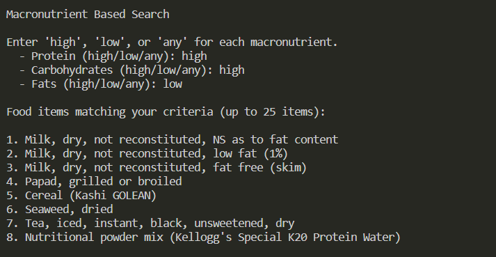

# Gourmet-Gains

## About The Project

Gourmet Gains is a Python-based application designed to help fitness enthusiasts and health-conscious individuals find the right foods based on nutrient data. Our goal is to assist users in diversifying their diet and making informed food choices to support their health and fitness objectives. 

### Features:

* **Macronutrient-based Search**: Discover food items based on specific macronutrient preferences like high protein or low carbs.
* **Food Item Analysis**: Enter and analyze specific food items for detailed nutrient breakdowns.
* **Personalized Recommendations**: Utilize advanced algorithms to get food recommendations similar to your favorite items.

### Built With

* ![Python]

<!-- GETTING STARTED -->
## Algorithms Implemented

In Gourmet Gains, we've implemented two core algorithms to enhance the user experience in finding suitable food items based on nutritional profiles:

### Djkstra's Alogrithm

* We chose Dijkstra’s algorithm for its efficiency in finding the shortest path in a graph. 
* In our context, this translates to identifying the closest food items to a given item based on their macronutrient profile. This algorithm is particularly effective in scenarios where we need to find the most nutritionally similar foods from a large dataset, providing our users with accurate and relevant recommendations.

### K-Nearest Neighbors Algorithm

* Another approach for food item recommendations based on macronutrient profiles.
* KNN was selected for its simplicity and effectiveness in classification problems. By considering the ‘nearest neighbors’ of a food item in terms of nutritional content, KNN allows us to recommend similar foods. This method is particularly useful for users seeking variety in their diet while maintaining specific nutritional goals. It’s an excellent choice for personalized recommendations, adapting to user preferences over time.

<!-- USAGE EXAMPLES -->
## Pictures

-------------------------------------------------------

-------------------------------------------------------

<!-- CONTACT -->
## Contact

Daniel Dovale - ddovale2004@gmail.com

Daniel Souza - daniel.souza@ufl.edu

Anteneh Zewdie - Antenehzewdie@ufl.edu

[Python]: https://img.shields.io/badge/Python-3776AB?style=for-the-badge&logo=python&logoColor=white